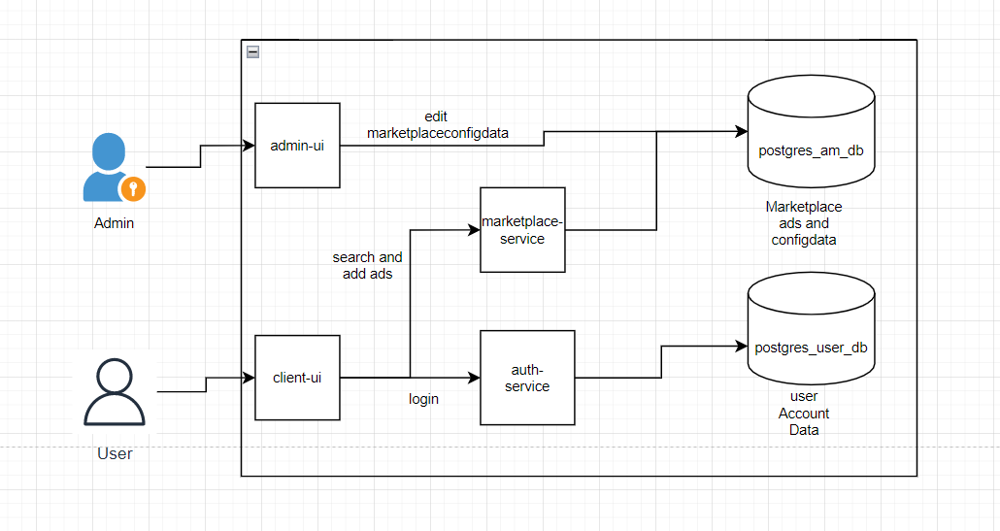
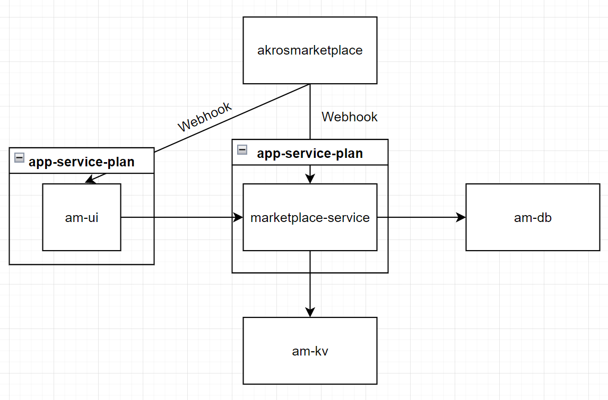

<!-- TABLE OF CONTENTS -->

<!-- @import "[TOC]" {cmd="toc" depthFrom=1 depthTo=2 orderedList=true} -->

<!-- code_chunk_output -->

1. [Introduction and Goals](#introduction-and-goals)
   1. [Requirements Overview](#requirements-overview)
   2. [Functional Requirements (EPICS)](#functional-requirements-epics)
   3. [Non-Functional Requirements (acc. BABOK, 2020, 9.17)](#non-functional-requirements-acc-babok-2020-917)
   4. [Quality Goals](#quality-goals)
   5. [Stakeholders](#stakeholders)
2. [Architecture Constraints](#architecture-constraints)
3. [System Scope and Context](#system-scope-and-context)
   1. [Business Context](#business-context)
   2. [Technical Context](#technical-context)
4. [Solution Strategy](#solution-strategy)
   1. [Frontend](#frontend)
5. [Building Block View](#building-block-view)
   1. [Whitebox Overall System](#whitebox-overall-system)
   2. [Level 2](#level-2)
6. [Runtime View](#runtime-view)
   1. [\<Use Case Diagram\>](#use-case-diagram)
   2. [\<Scenario 1 "Create an ad"\>](#scenario-1-create-an-ad)
   3. [\<Runtime Scenario 2\>](#runtime-scenario-2)
   4. [\<Runtime Scenario 3\>](#runtime-scenario-3)
   5. [\<Runtime Scenario n\>](#runtime-scenario-n)
7. [Deployment View](#deployment-view)
   1. [Infrastructure Level 1](#infrastructure-level-1)
8. [Cross-cutting Concepts](#cross-cutting-concepts)
   1. [_\<Concept 1\>_](#_concept-1_)
   2. [_\<Testing Concept\>_](#_testing-concept_)
   3. [_\<Concept n\>_](#_concept-n_)
9. [Design Decisions](#design-decisions)
10. [Quality Requirements](#quality-requirements)
    1. [Quality Tree](#quality-tree)
    2. [Quality Scenarios](#quality-scenarios)
11. [Risks and Technical Debts](#risks-and-technical-debts)
    1. [Technical Debts](#technical-debts)
    2. [Risks](#risks)
12. [Glossary](#glossary)

<!-- /code_chunk_output -->

<!-- ABOUT THE PROJECT -->

# Introduction and Goals

The goal is to create a marketplace for employees of Akros AG. The marketplace should employees allow to create offers, create
search requests and search for topics/ads in the marketplace.

We would like to give the marketplace together a general understanding and definition.
The targets are to be able to handle changes in the team quickly and to use strategic technologies and methodologies.

Why is an architecture important?
Experiences?
How to start and on which way?

## Requirements Overview

This document describes the Akros Marketplace, short AMP, which is an application for companies internal advertising and is used for search and advertise an appartement, a room a roommate. The application should be expandable to include additional categories to search and advertise e.g. ride- or clothes-sharing, rent a car, et cetera.

The application should serve

- to train and practice the Akros employee for current and future development processes, technologies and "best practices"
- to assess the candidates in the hiring process.

## Functional Requirements (EPICS)

| N   | Title                   | Description                                                                                       | Prio |
| --- | ----------------------- | ------------------------------------------------------------------------------------------------- | ---- |
| 1   | Expandability           | The software should be enhanced by features that are suitable to meet future needs of companies   | 1    |
| 2   | Search Accomodation     | The user can easily search for an appartement, a room or a roommate.                              | 1    |
| 3   | Advertise accommodation | The user can easily advertise an appartement, a room or a roommate.                               | 1    |
| 4   | Language Selection      | The user can switch between at least two languages (DE and EN). The application is multilanguage. | 2    |
| 5   | User Management         | Business transaction can be only executed by authenticated user.                                  | 2    |
| 6   | Profile administration  | The user has an overview of ads he has posted.                                                    | 3    |
| 7   | Search Accomodation     | The user can communicate through the application.                                                 | 3    |

## Non-Functional Requirements (acc. BABOK, 2020, 9.17)

| Prio | Category (based on ISO 9126)                                                                                                                                                                                                                                                                                                             | Measurement                                                                                                                            | Description                                                                                                                               | Usage considerations +/- |
| ---- | ---------------------------------------------------------------------------------------------------------------------------------------------------------------------------------------------------------------------------------------------------------------------------------------------------------------------------------------- | -------------------------------------------------------------------------------------------------------------------------------------- | ----------------------------------------------------------------------------------------------------------------------------------------- | ------------------------ |
| 1    | **Reliability** requirements include the ability of the application to recover from errors, uptime, or failures in the interfaces.                                                                                                                                                                                                       | <ul><li>percentage of the probability of failure</li><li>number of critical failures</li><li>time between critical failures </li></ul> |                                                                                                                                           |                          |
| 2    | **Performace** Efficency requirements include the time taken to perform activities and the resource utilization levels.                                                                                                                                                                                                                  |                                                                                                                                        |                                                                                                                                           |                          |
| 3    | **Operability** requirements include the extent to which users can recognize whether an application will actually fulfill their needs, the ease of learning the application, and the usability of the application.                                                                                                                       |                                                                                                                                        | 3.1 Internationalization: The application support i18N (dates, currency, numbers, text) which allows users to see data in their default . |                          |
| 4    | **Security** requirements include the ability to ensure appropriate confidentiality of information, the integrity of information stored in the application, the ability to verify whether actions were taken and by whom, and the ability to authenticate users.                                                                         | <ul><li>4.1 Acccount Creation:</li><li>4.2 Password generation:</li><li>4.3 Security questions:</li><li>4.4 Account locking:</li></ul> |                                                                                                                                           |                          |
| 5    | **Compatibility** requirements include requirements for properly replacing another application, the ability to co-exist with other applications, and the ability to interact with other applications.                                                                                                                                    |                                                                                                                                        |                                                                                                                                           |                          |
| 6    | **Maintainability** requirements include the ability to change one component without affecting others, the ability to re-use components, whether the application can be effectively tested and problems can be properly diagnosed, the ease of making changes, and the ability to implement changes without causing unexpected failures. |                                                                                                                                        |                                                                                                                                           |                          |
| 7    | **Transferability** requirements include the ease of installing and uninstalling the application, the kinds of different environments it can run in, and the ease of migrating it to a new environment.                                                                                                                                  |                                                                                                                                        |                                                                                                                                           |                          |

## Quality Goals

To be filled after MVP released.

## Stakeholders

- Jan Richter: Developer
- Berthold Talla: Developer
- Cristian Ayerbe: Developer
- Stefan Le-Mingh: Developer
- Martin Dobrev: Developer
- Hermann Kamdoum: Developer
- Irina Finger: Product Owner
- Timmy Aeberli: Business Analyst
- Iliyan Kostev: Designer
- André Hirter: Maintainer
- Heinz Lätsch: Maintainer
- Thomas Kneubühl: Sponsor

# Architecture Constraints

# System Scope and Context

## Business Context

The following diagram shows the most important AMP functions as a business flow. Colored boxes stand for the features in scope (going to be specify and develop next), white ones show the futureoriented functions.


**\<optionally: Explanation of external domain interfaces\>**

## Technical Context

# Solution Strategy

## Frontend

- Set the basic layout (Grid, structure etc.) with CSS-Grid and Flexbox to not be bound to a CSS-Frameworks opinionated guideline
- Implement Components using Webcomponent API that get imported and uses in the main application. This has the following advantages:
  - Components are mostly isolated from each and can have their own tech-stack without influencing any other component
  - As any technology can be used, it can serve as a great way to learn new technologies
- Configure a CI/CD-Pipeline to automate the building and packaging of the webcomponents for the deployment of the main application
- Use JestJS as the unit-test framework and set a threshold for minimum code-coverage to achieve a high test coverage and lower execution time

# Building Block View

## Whitebox Overall System

**_Overview Diagram_**

Motivation

: _\<text explanation\>_

Contained Building Blocks



1. client-ui : allows the user to interact with the marketplace App. He can search , add ads and also do a login.
2. admin-ui: This modules configures all dynamic parameters of the marketplace.
3. marketplace-service : serves the Rest-Services for the UI.
4. auth-service: serves the authentication of the users.
5. postgres_user_db: is used to store user and Accountdata.
6. postgres_am_db: is used to store marketplace ads and configdata.

Important Interfaces

: _\<Description of important interfaces\>_

### client-ui

The client-ui allows the user to interact with the marketplace App. He can search, add ads and also do a login. It resides in the _./am-ui_ directory.

The client-ui consists of a "main"-frontend (written in Angular), which acts as the container for multiple webcomponents (Can be written in any technology).
The main-frontend is responsible for the navigation and the layout of the entire application whereas the web-components are the ones implementing the actual business logic and have a fitting name. Therefore, the client-stubs generated from the OpenAPI-Spec for the marketplace service is also to be done **only in the webcomponents**.

### admin-ui

This modules configures all dynamic parameters of the marketplace.
_Its implementation has been started but has not been kept up with the rest of the project and will be properly implemented and documented at a later date._

<!-- _\<Interface(s)\>_

_\<(Optional) Quality/Performance Characteristics\>_

_\<(Optional) Directory/File Location\>_

_\<(Optional) Fulfilled Requirements\>_

_\<(optional) Open Issues/Problems/Risks\>_ -->

### marketplace-service

This module provides the rest services directly concerning the marketplace functionality for the UI. This includes things such as the creation and search of ads. It resides in _./marketplace-service_.
Additionally, upon running `mvn clean install`, a plugin runs, that checks the `api.yaml` file, residing in the root directory, whether it conforms to the [Zalando REST API guidelines](https://opensource.zalando.com/restful-api-guidelines/).

<!-- _\<(Optional) Quality/Performance Characteristics\>_

_\<(Optional) Fulfilled Requirements\>_

_\<(optional) Open Issues/Problems/Risks\>_ -->

### auth-service

Serves the authentication of the users.
_Its implementation has been started but has not been kept up with the rest of the project and will be properly implemented and documented at a later date._

<!-- _\<(Optional) Quality/Performance Characteristics\>_

_\<(Optional) Directory/File Location\>_

_\<(Optional) Fulfilled Requirements\>_

_\<(optional) Open Issues/Problems/Risks\>_ -->

### postgres_user_db

This module is used to store user and Accountdata.
_Its implementation has been started but has not been kept up with the rest of the project and will be properly implemented and documented at a later date._

<!-- _\<(Optional) Quality/Performance Characteristics\>_

_\<(Optional) Directory/File Location\>_

_\<(Optional) Fulfilled Requirements\>_

_\<(optional) Open Issues/Problems/Risks\>_ -->

### postgres_am_db

This module is used to store marketplace ads and configdata. Its initialization is found in the `./infrastructure/db_init_am` directory and its changelog, powered by liquibase, can be found in `./marketplace-service/src/main/resources/liquibase`.

## Level 2

### White Box client-ui

The current webcomponents, all residing in _./am-ui/webcomponents_, are:

- search-webcomponent
  - Written with Angular and TailwindCSS
  - Responsible for the search
- search-results-webcomponent
  - Written with ReactJS
  - Responsible for displaying the search-results
- create-ad-webcomponent
  - Written with VueJS
  - Responsible for the creation of ads

# Runtime View


## \<Use Case Diagram\>

 

## \<Scenario 1 "Create an ad"\>

_USC 1: Create an ad_

_Precondition:_

- The user is logged in the application
- The user is on the Homepage of the application

_Basic flow: Create an ad_

1. On the Homepage the user sees the possibility to create an ad.
2. The user selects [Create] Button.
3. The system shows the list of categories that can be selected.
4. The user selects the category and confirm.
5. The system shows the input criteria for selected category.
6. User fills required fields, upload related pictures, give his contact address and confirm.
7. The system validates the fields, ensures that the mandatory fields are filled and valid and shows the user his ad as a preview.
8. The user checks the detail view of his ad. He has the possibility to go back to the creation page and correct the date or publish the ad.
9. The user publish ad.

_Postcondition:_

- the ad is published and can be found by the search
- the ad is visible in the user account

## \<Runtime Scenario 2\>

- Delete an accommodation ad

## \<Runtime Scenario 3\>

_USC 3: Search for accommodation_

_Precondition:_

- user has Akros AD
- user start APM ad and is on the Home page

_Basic flow: default search_

1. On the Home page the user see the possibility to search for category accommodation incl. search criteria for this category. Search criteria have no default.
2. The user select search, without providing the search criteria.
3. The system search for all ads, created in this category, and show the results as a gallery of a pictures with minimal additional information to each ad (e.g. address)
4. The user selects an ad.
5. The system shows detail view of the ad. The user have the possibility to go back to the search results.

Alternative flow 1: search for appartement

Alternative flow 2: search for a room

Alternative flow 3: search for roommate

_Postcondition:_

- no

## \<Runtime Scenario n\>

# Deployment View

## Infrastructure Level 1



| Node / Artifact     | Description                                                                                               |
| ------------------- | --------------------------------------------------------------------------------------------------------- |
| akrosmarketplace    | Container Registry for the Project. Has webhooks for the Github Actions to deploy from the CI/CD pipeline |
| am-ui               | App-Service for the Frontend, wrapped in a Service Plan                                                   |
| marketplace-service | App-Service for the Marketplace-Service, wrapped in a Service Plan                                        |
| am-db               | Postgres-Database                                                                                         |
| am-kv               | Keyvault containing the database connection string for the backend                                        |

# Cross-cutting Concepts

## _\<Concept 1\>_

_\<explanation\>_

## _\<Testing Concept\>_

_\<Continuous integration (CI) is a software practice that requires frequently committing code to a shared repository. Committing code more often detects errors sooner and reduces the amount of code a developer needs to debug when finding the source of an error. Frequent code updates also make it easier to merge changes from different members of a software development team. This is great for developers, who can spend more time writing code and less time debugging errors or resolving merge conflicts.\>_

We would like to implement [continuous integration using GitHub Actions](https://docs.github.com/en/actions/automating-builds-and-tests/about-continuous-integration)

````
```
import static com.qmetry.qaf.automation.step.client.RuntimeScenarioFactory.scenario;
@Test(description="")
        public void testWithGivenWhenThen() {
                scenario().
                given("a precondition",()->{
                        //write appropriate code...
                }).
                when("some action performed",()->{
                        //write appropriate code...
                }).
                then("it should have expected outcome",()->{
                        //write appropriate code...
                }).
                execute();
        }
```
````

...

## _\<Concept n\>_

_\<explanation\>_

# Design Decisions

# Quality Requirements

## Quality Tree

## Quality Scenarios

# Risks and Technical Debts

## Technical Debts

A list of the technical debts can be found in the [Github Project](https://github.com/orgs/AkrosAG/projects/6/views/13).

## Risks

### Active Team

The team composition's volatility makes this project a bit of a challenge - The composition can change at any given time and the priority to work on it is also set on the lowest. Thus it is harder to plan under these circumstances.
Furthermore, as the team is not set, missing seniority in certain competences can be lacking.
As the team can change at any moment, it will be a challenge to keep the coding standards and guidelines uniform.
Nonetheless it isn't an urgent risk as this project also has no deadline or any other urgency to it. Any lack of competency can be compensated by being able to take the time to learn that skill.

# Glossary

| Term          | Definition |
| ------------- | ---------- |
| Topic         |            |
| Category      |            |
| Advertisement |            |
