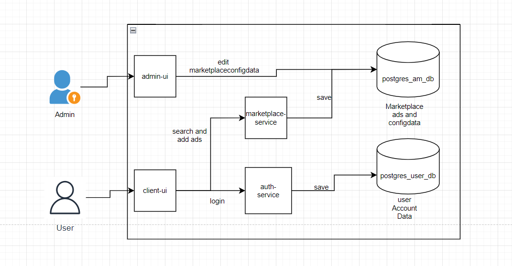

Introduction and Goals
======================
The goal is to create a marketplace for employees of Akros AG. The marketplace should employees allow to create offers, create 
search requests and search for topics/ads in the marketplace.

We would like to give the marketplace together a general understanding and definition.
The targets are to be able to handle changes in the team quickly and to use strategic technologies and methodologies.

Why is an architecture important? 
Experiences?
How to start and on which way?

Requirements Overview
---------------------

This document describes the Akros Marketplace, short AMP, which is an application for companies internal advertising and is used for search and advertise an appartement, a room a roommate. The application should be expandable to include additional categories to search and advertise e.g. ride- or clothes-sharing, rent a car, et cetera.

The application should serve

 - to train and practice the Akros employee for current and future development processes, technologies and "best practices"
 - to assess the candidates in the hiring process.

Quality Goals
-------------

To be filled after MVP released.

Stakeholders {#_stakeholders}
------------

- Jan Richter: Developer
- Berthold Talla: Developer
- Cristian Ayerbe: Developer
- Stefan Le-Mingh: Developer
- Martin Dobrev: Developer
- Hermann Kamdoum: Developer
- Irina Finger: Product Owner
- Timmy Aeberli: Business Analyst
- Iliyan Kostev: Designer
- Andrè Hirter: Maintainer
- Heinz Lätsch: Maintainer

Architecture Constraints
========================

System Scope and Context
========================

Business Context
----------------

The following diagram shows the most important AMP functions as a business flow. Colored boxes stand for the features in scope (going to be specify and develop next), white ones show the futureoriented functions.

**\<optionally: Explanation of external domain interfaces\>**

Technical Context
-----------------

Solution Strategy
=================

Building Block View
===================

Whitebox Overall System
-----------------------

***\<Overview Diagram\>***

Motivation

:   *\<text explanation\>*

Contained Building Blocks

:   *\<Description of contained building block (black boxes)\>*

client-ui : allows the user to interact with the marketplace App. He can search , add ads ans also make a login.

admin-ui: This modules configures all dynamic parameter of the marketplace.

marketplace-service : This module serves the Rest-Services for the UI. 

auth-service: This module serves the authentication of the users.

postgres_user_db: This Postgres database is used to store user and Accountdata.

postgres_am_db: This Database is used to store marketpllace ads and configdata. 

Important Interfaces

:   *\<Description of important interfaces\>*

### \<Name black box 1\> {#__name_black_box_1}

*\<Purpose/Responsibility\>*

*\<Interface(s)\>*

*\<(Optional) Quality/Performance Characteristics\>*

*\<(Optional) Directory/File Location\>*

*\<(Optional) Fulfilled Requirements\>*

*\<(optional) Open Issues/Problems/Risks\>*

### \<Name black box 2\> {#__name_black_box_2}

*\<black box template\>*

### \<Name black box n\> {#__name_black_box_n}

*\<black box template\>*

### \<Name interface 1\> {#__name_interface_1}

...

### \<Name interface m\> {#__name_interface_m}

Level 2 {#_level_2}
-------

### White Box *\<building block 1\>* {#_white_box_emphasis_building_block_1_emphasis}

*\<white box template\>*

### White Box *\<building block 2\>* {#_white_box_emphasis_building_block_2_emphasis}

*\<white box template\>*

...

### White Box *\<building block m\>* {#_white_box_emphasis_building_block_m_emphasis}

*\<white box template\>*

Level 3 {#_level_3}
-------

### White Box \<\_building block x.1\_\> {#_white_box_building_block_x_1}

*\<white box template\>*

### White Box \<\_building block x.2\_\> {#_white_box_building_block_x_2}

*\<white box template\>*

### White Box \<\_building block y.1\_\> {#_white_box_building_block_y_1}

*\<white box template\>*

Runtime View {#section-runtime-view}
============

\<Runtime Scenario 1\> {#__runtime_scenario_1}
----------------------

-   *\<insert runtime diagram or textual description of the scenario\>*

-   *\<insert description of the notable aspects of the interactions
    between the building block instances depicted in this diagram.\>*

\<Runtime Scenario 2\> {#__runtime_scenario_2}
----------------------

... {#_}
---

\<Runtime Scenario n\> {#__runtime_scenario_n}
----------------------

Deployment View {#section-deployment-view}
===============

Infrastructure Level 1 {#_infrastructure_level_1}
----------------------

***\<Overview Diagram\>***

Motivation

:   *\<explanation in text form\>*

Quality and/or Performance Features

:   *\<explanation in text form\>*

Mapping of Building Blocks to Infrastructure

:   *\<description of the mapping\>*

Infrastructure Level 2 {#_infrastructure_level_2}
----------------------

### *\<Infrastructure Element 1\>* {#__emphasis_infrastructure_element_1_emphasis}

*\<diagram + explanation\>*

### *\<Infrastructure Element 2\>* {#__emphasis_infrastructure_element_2_emphasis}

*\<diagram + explanation\>*

...

### *\<Infrastructure Element n\>* {#__emphasis_infrastructure_element_n_emphasis}

*\<diagram + explanation\>*

Cross-cutting Concepts {#section-concepts}
======================

*\<Concept 1\>* {#__emphasis_concept_1_emphasis}
---------------

*\<explanation\>*

*\<Concept 2\>* {#__emphasis_concept_2_emphasis}
---------------

*\<explanation\>*

...

*\<Concept n\>* {#__emphasis_concept_n_emphasis}
---------------

*\<explanation\>*

Design Decisions {#section-design-decisions}
================

Quality Requirements {#section-quality-scenarios}
====================

Quality Tree {#_quality_tree}
------------

Quality Scenarios {#_quality_scenarios}
-----------------

Risks and Technical Debts
=========================

To be filled after MVP released.

Glossary {#section-glossary}
========

+-----------------------+-----------------------------------------------+
| Term                  | Definition                                    |
+=======================+===============================================+
| *\<Term-1\>*          | *\<definition-1\>*                            |
+-----------------------+-----------------------------------------------+
| *\<Term-2\>*          | *\<definition-2\>*                            |
+-----------------------+-----------------------------------------------+
