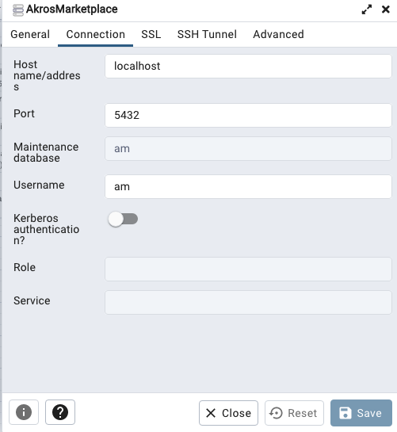
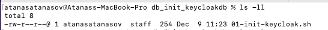
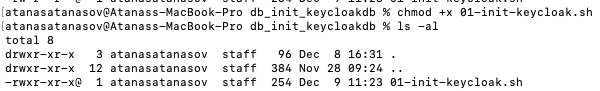

## Local development setup guide (Fullstack) - Marketplace

### Getting started 
To build the local environment the following steps must be followed.
1. For a clean start, all local docker images, containers, and volumes must be removed first. 
This can be easily achieved using the command below. The command should be executed from the start_dev folder.
   ```
   # UNIX based
   sh delete_all_local.sh
   
   # Windows
   ./ delete_all_local.sh
   ```
2. Then docker containers must be started. They are used to start and configure the databases and the authentication services.
   The application can be started in two different ways - one for development and one for testing the functionality of
   the entire system (frontend + backend).

- For starting the **entire** system the command below should be executed and the next steps must be **ignored**. 
   The frontend will be accessible from the following link: https://localhost:4200 and the backend: https://localhost:8443

   ```
    docker-compose --profile local up -d --build
   ```
- For configuring the local development the command below should be executed and the next steps from the README should be followed.

   ```
    docker-compose up -d --build
   ```
3. Starting the backend(marketplace-service) - If containers are set correctly, the backend should be started from the 
IDE. The application should be accessible from the following link: https://localhost:8443
4. Starting the frontend(am-ui) - Navigate to the frontend folder and execute the following commands:
   ```
   npm install
   ```
   ```
    npm run start_ssl
   ```
   The application should be running on the following link: https://localhost:4200

### Additional information

For the authentication is used keycloak. More information can be found in the following [link](https://www.keycloak.org/).
The market-place database is named: _postgres_am_db_ and it runs on port 5432. To log in to the database pgadmin can be used.
Example for login via pgadmin:

<p align="center">
   
</p>

Marketplace database credentials - database: am username: am

Keyclock database credentials: - database: keycloakdb username: keycloakdb 

### Possible problems
- Make sure that the postgres is not started as a service on your local machine, because this is the default port for the postgres instance,
  that's why a running instance can lead to problems!
- Permission denied: Check files with extension _.sh_ the line separator format should be **LF** NOT **CRLF**.
  The easiest way is in Notepad, Visual Studio Code, or IntelliJ
- Permission denied **UNIX** based operating systems: Make sure that all files with
  extension _.sh_ have **read, write** and **execute** permissions. This can be checked in the directory of the file with
  the command ``` ls -ll```. The second, third and fourth characters should look similar to the output below (**rwx**):
  ```
  -rwxr-xr-x@  1 atanasatanasov  staff  254 Dec  9 11:23 01-init-keycloak.sh
  ```
  The first picture below shows how a problem with the permissions might look.

  <p align="center">
   
  </p>
  <br/>
  The second picture shows how the permissions problem was fixed.
   <p align="center">
   
  </p>
